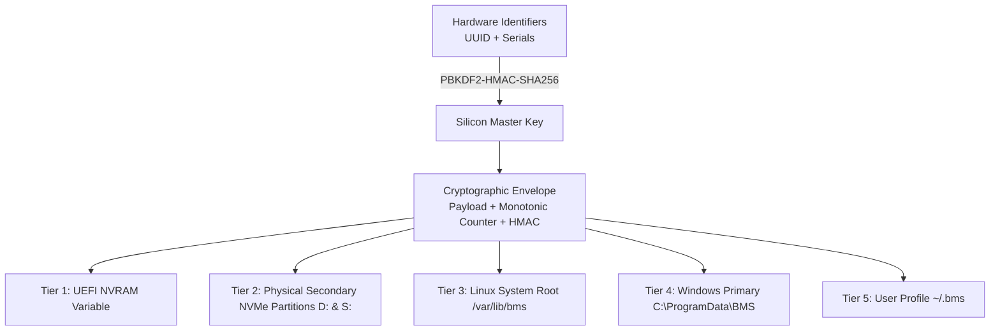

# BMS Telemetry: Deep Architectural Specification

## 1. The Root Cause: OEM ACPI DSDT Firmware Omission

Standard battery reporting across modern operating systems relies on the ACPI specification:
- **ACPI 1.0 `_BIF` (Battery Information):** Reports static attributes (Power Unit, Design Capacity, Full Charge Capacity, Battery Technology, Design Voltage, Warning/Low Capacities). It contains **13 package elements** and **omits the cycle counter**.
- **ACPI 4.0 `_BIX` (Battery Information Extended):** Extends `_BIF` to **21 package elements**, where **element 8** explicitly defines `Cycle Count`.

### Disassembly of Infinix ZERO BOOK 13 DSDT (`EM_IDL822_V2.0`)
Decompilation of the motherboard's ACPI tables reveals that within device `\_SB.PC00.LPCB.H_EC.BAT0`:
1. Method `_BIF` is implemented and queries Embedded Controller RAM registers (`EC_REG_BC0`, etc.).
2. Method `_BIX` is **entirely missing**.
3. When the operating system driver queries `_BIX`, the ACPI interpreter returns `AE_NOT_FOUND`.
4. The OS driver falls back to `_BIF`, setting native cycle count to `0`.

---

## 2. The 30-Decimal Arbitrary-Precision Engine

To prevent IEEE 754 64-bit double-precision floating-point collapse (which caps precision at ~15–17 digits), the BMS engine uses Python's arbitrary-precision `decimal.Decimal` module configured with a 60-digit internal precision context:

```python
getcontext().prec = 60
DEC_30 = Decimal("0." + "0" * 30)
```

### Cumulative Coulomb Integration
During runtime operation, the cycle counter integrates real-time energy flow:
$$\text{Cycle}_{\text{accumulated}} = \text{Cycle}_{\text{base}} + \sum_{i} \frac{\Delta E_i}{Q_{\text{design}}}$$
Every fractional energy delta $\Delta E_i$ is computed in 60-digit fixed-point math and quantized to 30 decimal digits (`f"{cycles:.30f}"`), ensuring zero loss over millions of evaluation cycles.

---

## 3. Multi-Factor Electrochemical Degradation Model

The **Virtual Health Percentage (SoH%)** models physical battery degradation using electrochemical physics principles:

$$\text{Virtual Health \%} = \text{SoH}_{\text{base}} - \Delta \text{SoH}_{\text{cycle}} - \Delta \text{SoH}_{\text{thermal}} - \Delta \text{SoH}_{\text{voltage}} - \Delta \text{SoH}_{\text{impedance}}$$

### A. Base Coulombic Ratio
$$\text{SoH}_{\text{base}} = \min\left(100.0, \frac{\text{FCC}}{\text{Design Capacity}} \times 100.0\right)$$

### B. Power-Law SEI Cycle Degradation
Solid Electrolyte Interphase (SEI) growth on the graphite anode follows diffusion-limited power-law kinetics:
$$\Delta \text{SoH}_{\text{cycle}} = A \cdot (N_{\text{cycles}})^z$$
- $z = 0.82$ (kinetic exponent for Li-ion pouch cells)
- $A = \frac{20.0}{500^{0.82}} \approx 0.122858$ (calibrated to 80% retention at 500 equivalent full cycles)

In `Decimal`, power evaluation uses natural logarithms and exponentials:
$$\text{cycle\_term} = \exp(0.82 \cdot \ln(N_{\text{cycles}}))$$

### C. Arrhenius Thermal Acceleration
Thermal aging accelerates exponentially according to the Arrhenius relationship:
$$\Theta(T) = \exp\left( -\frac{E_a}{R} \left( \frac{1}{T_K} - \frac{1}{T_{\text{ref}}} \right) \right)$$
- $E_a / R = 3788\text{ K}$ (activation energy divided by universal gas constant)
- $T_{\text{ref}} = 298.15\text{ K}$ ($25.0^\circ\text{C}$)
- $\Delta \text{SoH}_{\text{thermal}} = 0.005 \cdot \max(0, \Theta(T) - 1.0) \cdot N_{\text{cycles}}$

### D. High-Voltage Float Overpotential
Holding cells at elevated voltage ($>4.15\text{ V}$/cell, $>11.55\text{ V}$ pack) under AC mains accelerates cathode dissolution:
$$\Delta \text{SoH}_{\text{voltage}} = 0.25 \cdot \left( \frac{\max(0, V_{\text{pack}} - V_{\text{nom}})}{V_{\text{nom}}} \right)^2 \cdot \left( \frac{\text{SoC}}{100.0} \right)$$

---

## 4. Hardware-Anchored Persistence Matrix



### Zero-Data-Loss Invariant
1. Disk 0 contains partition `C:\` (Windows OS).
2. Disk 1 contains physical partitions `D:\` and `S:\`.
3. When `C:\` is formatted, partitions on Disk 1 are untouched.
4. On initial boot after an OS wipe, `load_state()` searches all tiers, validates the HMAC-SHA256 signature using the physical motherboard's derived key, identifies the replica with the highest monotonic sequence, and restores the canonical cycle ledger with zero data loss.
